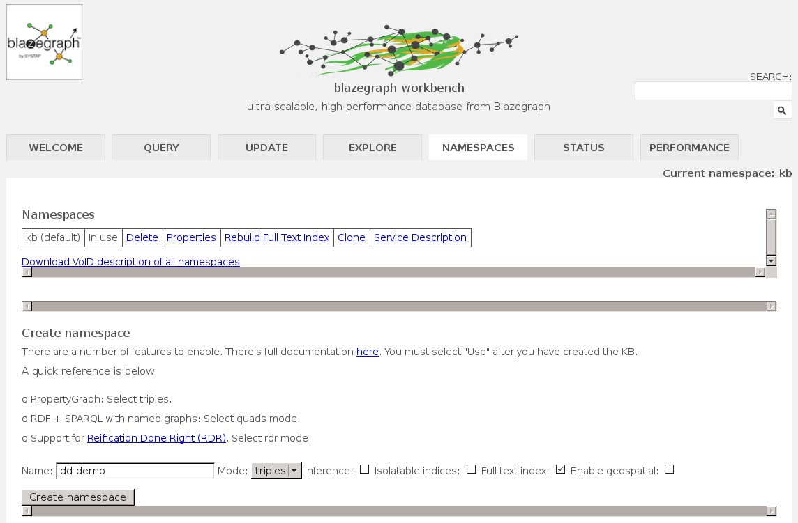

# Installation and setup

This is the Linked Data Demonstrator ran by WUR. It is currently running at [https://www.plantbreeding.wur.nl/ld-demonstrator/](https://www.plantbreeding.wur.nl/ld-demonstrator/).

Instructions for its setup can be found below.

This project is based on an earlier version of [DTL's linked data demonstrator](https://github.com/DTL-FAIRData/linked-data-demo).

## Set up Blazegraph

* Get the [executable jar](https://wiki.blazegraph.com/wiki/index.php/NanoSparqlServer#Downloading_the_Executable_Jar).
* Run the server:  
  `java -server -Xmx4g -jar path/to/blazegraph.jar`  
  <!--`java -server -Xmx4g -jar C:\Users\papou001\My_portable_apps\Blazegraph\blazegraph.jar`  -->
  
* The Blazegraph GUI should now be live at [`http://localhost:9999`](http://localhost:9999)

* Create a namespace for your project at [`http://localhost:9999/blazegraph/#namespaces`](http://localhost:9999/blazegraph/#namespaces). 

For this example, the namespace will be `ldd-demo`. After creating it, make sure to also `Use` the namespace.

* Adapt your data into the semantic model used by the demonstrator (see [section](#bringing-your-data-to-the-demonstrator-format) below).

* Go to the [Update tab](http://localhost:9999/blazegraph/#update) to load your data (triples). You can click on `Browse` to manually select your files in the filesystem, or provide the commands in the interface with the absolute paths for the files (e.g. `load <file:///tmp/blazegraph/data.n3>`), as seen on the screenshot. Make sure that the correct namespace is used.

")

* Verify that this particular namespace can be queried. You can do this through the `Query tab`.  
Alternatively, you can submit a request directly.
E.g. to query with `select distinct ?p where {?s ?p ?o} limit 10 `, navigate to
[`http://localhost:9999/blazegraph/namespace/ldd-demo/sparql?format=json&query=select distinct ?p where {?s ?p ?o} limit 10`](http://localhost:9999/blazegraph/namespace/ldd-demo/sparql?format=json&query=select%20distinct%20%3Fp%20where%20%7B%3Fs%20%3Fp%20%3Fo%7D%20limit%2010)  
In this case, the base URL for querying your namespace is `http://localhost:9999/blazegraph/namespace/ldd-demo/sparql`.

## Set up the redirection layer

Clone the [linked-data-demo_redirect project](https://github.com/PBR/linked-data-demo_redirect) and follow the instructions there.  

Additionally, you will likely have to modify the [`js/config.js` file](js/config.js) in this project, and make it point to the location where the redirection script is running. This is stated in the [SPARQL_ENDPOINT variable](js/config.js#L1).

## Bringing your data to the demonstrator format

The demonstrator expects RDF. Feel free to produce your own file, as long as it adheres to the semantic model as described [here (schema)](https://drive.google.com/open?id=1qc4JK6UPkcqrnceJb24bsM2_JMGKjo7ZjTAcTmz2D4o) and [here (publication)](http://ceur-ws.org/Vol-1933/poster-paper-12.pdf). 

Note that placeholder terms have been used where necessary (prefix `WUR_ont`).

For ease of use, you can fill in the [excel template](format_data/data_template.xlsx) provided in this project with some of your data, and then run the [accompanying script](format_data/template_to_triples.py) to convert it into a turtle file.

The conversion script has been tested on Python 2.7 and 3.5, and uses the [rdflib](https://pypi.python.org/pypi/rdflib) and [xlrd](https://pypi.python.org/pypi/xlrd) modules. They can be installed through pip: 
`pip install xlrd`  
`pip install rdflib`

Fill in the template, and run the script on the excel file:  
`python data_template.xlsx`

This will produce a `data.ttl` file with your data formatted according to the demonstrator's semantic model.

